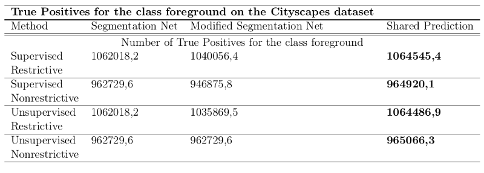

#  Improving Image Based Object Detection of Street Scenes with the Help of Depth Estimations

# Abstract
One of the major issues in autonomous driving is the question of how an autonomous vehicle correctly perceives it's surrounding environment, which is given by a street scene. That means once a street scene is perceived, how it can be achieved that all the scenes objects are detected successfully, specially those objects that pose a danger for driving. A state of the art approach to that problem is to let semantic segmentation algorithms do the task of detecting the different objects that are in the scene. Those semantic segmentation algorithms use an adapted form of Convolutional Neural Networks (CNNs), so-called Semantic Segmentation Networks. Despite the fact that Semantic Segmentation Networks has been increasingly successful in performing on object detection tasks in recent years, their performance is still somewhat limited. Even the best Semantic Segmentation Networks can not provide a level of accuracy, where autonomous driving can be seen as safe. In the following we propose and examine a possible way how to improve the performance Semantic Segmentation Networks with the help of depth estimations. In general depth estimations are used for predicting the distance of objects relative to a camera. Here we utilize depth estimations as a backup for the Semantic Segmentation Network and derive a common prediction, consisting of a combination of a depth estimation and a predicted semantic segmentation. Then we compare the results that are received by the common prediction with the single prediction of the semantic segmentation network. With clear evidence it can be shown that compared to the single prediction the common prediction provides the best performance for all considered metrics.
#  Method

#  Used Datasets
The first dataset we are using in this evaluation is the **Cityscapes** dataset. The Cityscapes dataset is a datasset, that is especially generated to enable the evaluation of semantic segmentation algorithms in the context of street scenes and contains 5000 pixel wise annotated images, that are covering 50 different cities. The Cityscapes dataset can be found here: https://www.cityscapes-dataset.com/
 
 
The second dataset we are utilizing is the **Lost and Found** dataset. Unlike the Cityscapes dataset the Lost and Found dataset has its focus on enabling semantic segmentation algorithms detecting small obstacles on the road (e.g. lost hazardous cargo), which can be potentially dangerous. The Lost and Found dataset can be found here: https://www.6d-vision.com/lostandfounddataset
#  Used Networks
We used two different types of networks. The first type is a  **semantic segmentation network** and the second typ is **depth network**. Within the depth networks we distinguish between two different types: Depth networks that make use of a **supervised learning approach** and those depth networks that make use of an **unsupervised learning approach**. 
 
 
The semantic segmenation network we are using throughout this examination can be found here: https://github.com/bryanyzhu/semantic-segmentation. For the depth networks we are using, you can visit
- https://github.com/cleinc/bts 
for the supervised learning approach and
- https://github.com/mrharicot/monodepth 
for the unsupervised approach.
#  True Positive Results on Cityscapes

#  True Positives Results on Lost and Found

#  Results for the Recall

#  Results for the Precision

#  References
<a id="1">[1]</a> 
Cordts, Marius, et al. (2015). 
The cityscapes dataset.
CVPR Workshop on the Future of Datasets in Vision. Vol. 2. sn, 2015.

<a id="1">[2]</a> 
Pinggera, Peter, et al. (2016). 
Lost and found: detecting small road hazards for self-driving vehicles.
2016 IEEE/RSJ International Conference on Intelligent Robots and Systems (IROS). IEEE, 2016.

<a id="1">[3]</a> 
Zhu, Yi, et al. (2019). 
Improving semantic segmentation via video propagation and label relaxation.
Proceedings of the IEEE/CVF Conference on Computer Vision and Pattern Recognition. 2019.

<a id="1">[4]</a> 
Lee, Jin Han, et al. (2019). 
From big to small: Multi-scale local planar guidance for monocular depth estimation.
arXiv preprint arXiv:1907.10326 (2019).

<a id="1">[5]</a> 
Godard, Clément, Oisin Mac Aodha, and Gabriel J. Brostow (2017). 
Unsupervised monocular depth estimation with left-right consistency.
arXiv preprint arXiv:1907.10326 (2019).

# Acknowledgments
I would like to thank Cordts et al. (2015) for their permission to use some images of the Cityscapes dataset in this 
repository.
